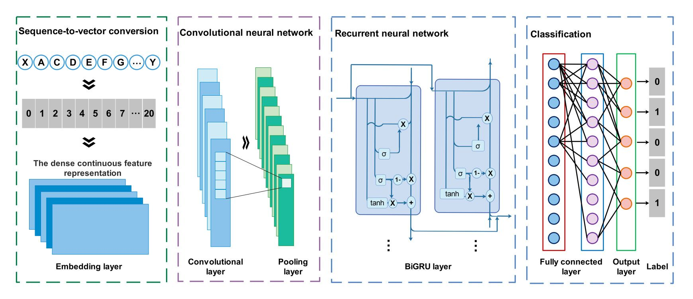

# MLBP
Identifying bioactive peptide function using multi-label deep learning


## Introduction
Motivation: 

The bioactive peptide has wide applications, such as lowering blood glucose levels, blood pressure, reducing inflammation, and resistance diseases. However, it is exceedingly expensive and time-consuming for experiments to determine the function of numerous peptides. Therefore, computational methods such as machine learning are becoming more and more important for peptide function prediction. Meanwhile, there are finitude research about applying the deep learning method to address multi-label bioactive peptide prediction. In this study, we develop a deep learning approach that determining the peptide function.

Results: 

We propose a multi-label classification model, named MLBP, to predict peptide function. In the field of functional peptide prediction, compared with state-of-the-art single-label predictor, MLBP can predict multiple functions including anti-cancer, anti-diabetic, anti-hypertensive, anti-inflammatory and anti-microbial simultaneously. Meanwhile, our model takes the raw sequence vector as input to replace biological features encoding from peptide sequences, extracts convolution and sequence features from the raw sequence, and combines with recurrent neural network to improve the prediction performance. The validation experiments conducted on the dataset show that MLBP has superior prediction performance. 




## Related Files

#### MLBP

| FILE NAME           | DESCRIPTION                                                  |
| :------------------ | :----------------------------------------------------------- |
| main.py             | the main file of MLBP predictor (include data reading, encoding, and data partitioning) |
| train.py            | train model |
| model.py            | model construction |
| test.py             | test model result |
| evaluation.py       | evaluation metrics (for evaluating prediction results) |
| data                | data         |
| BiGRU_base          | models of MLBP           |


## Installation
- Requirement
  
  OS：
  
  - `Windows` ：Windows7 or later
  
  - `Linux`：Ubuntu 16.04 LTS or later
  
  Python：
  
  - `Python` >= 3.6
  
- Download `MLBP`to your computer

  ```bash
  git clone https://github.com/xialab-ahu/MLBP.git
  ```

- open the dir and install `requirement.txt` with `pip`

  ```
  cd MLBP
  pip install -r requirement.txt
  ```


## Run MLBP on a new test fasta file
```shell
python predictor.py --file test.fasta --out_path result
```

- `--file` : input the test file with fasta format

- `--out_path`: the output path of the predicted results


## Contact
Please feel free to contact us if you need any help.

